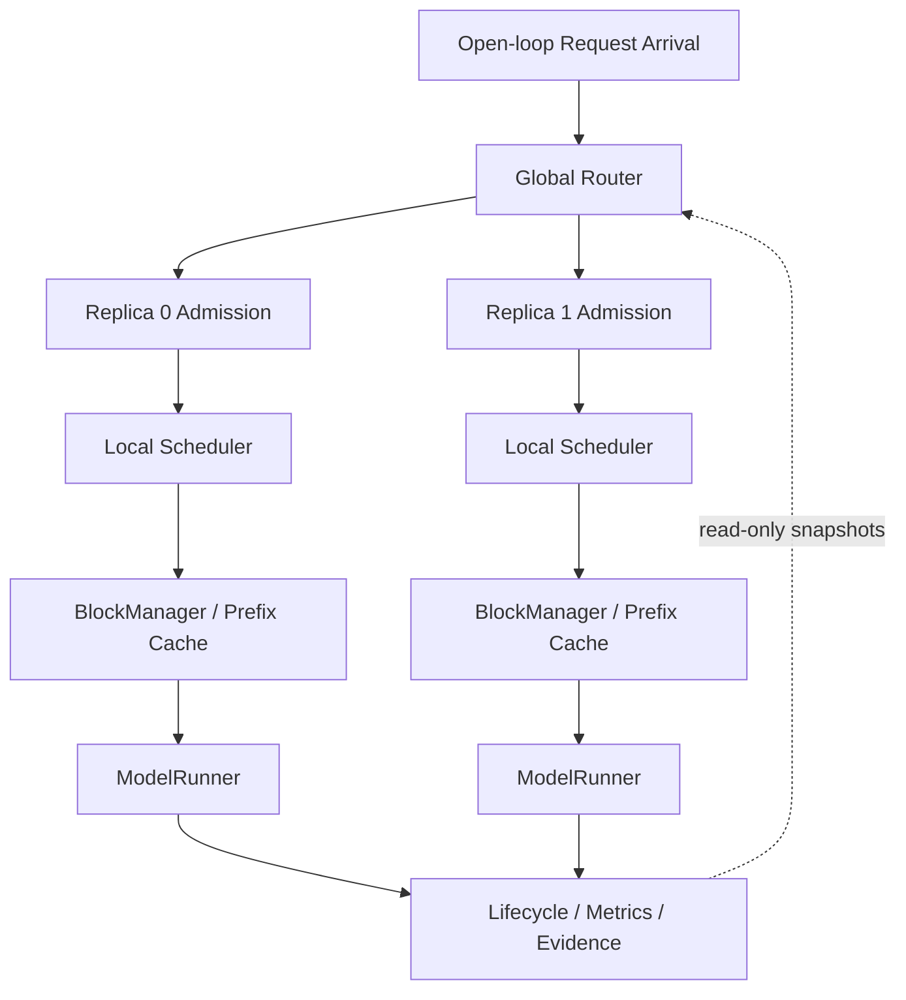
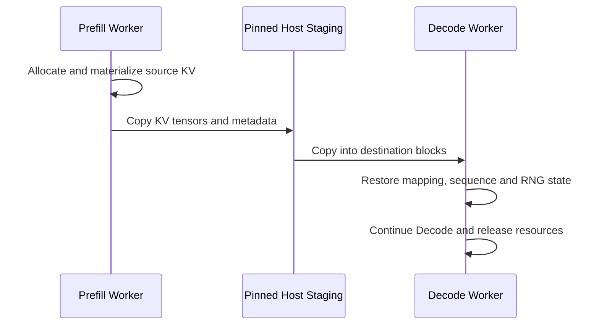

# 最终系统架构

本文件给出系统级架构摘要；状态所有权、调用关系、State Machine 与 P/D 数据流详见 [`docs/SYSTEM_DESIGN.md`](docs/SYSTEM_DESIGN.md)。

## 总体链路



Global Router 位于 Admission 之前。每个 Replica 独立拥有 queue、Scheduler、BlockManager、KV/Prefix Cache 与 execution state。Router 只读取 snapshot 并选择目标，不把多个 Replica 的 KV 合并为共享池；Admission 决定 request 是否进入目标 Replica；Scheduler 决定已接纳 request 的 token-level progress。

## Upstream 与扩展边界

| 层 | Nano-vLLM upstream | 本项目扩展 |
|---|---|---|
| Execution | FlashAttention、CUDA Graph、Triton KV write、Tensor Parallel | mixed phase metadata、P/D state restore |
| KV | Paged KV Cache、Prefix Cache、`BlockManager` | prefix preview、request reservation、incremental allocation、KV transfer/remapping |
| Scheduling | Continuous Batching、基础 `Scheduler` | pressure/recompute/Bounded Drain、global token budget、progress/SLO guards |
| Serving | offline engine API | Open-loop lifecycle、Admission、Multi-Replica Router、1P1D runner |
| Evidence | 基础测试 | raw aggregation、fingerprint、GPU provenance、fail-closed review |

项目没有自研 FlashAttention、PagedAttention 或 CUDA/Triton kernel。

## 核心状态所有权

| 组件 | 拥有/修改 | 只读输入 | 输出 |
|---|---|---|---|
| `RoundRobinRouter` / `ResourceAwareRouter` | tie-break 与 routing decision | Replica snapshot、prefix preview | target replica、reason |
| Admission layer | reservation 与 admit/reject lifecycle | request footprint、SLO/ETA、local KV preview | admitted/rejected request |
| `Scheduler` | waiting/running queue、step policy、preemption/drain state | KV pressure、request progress/slack | `ScheduledSequence` / `MixedScheduleBatch` |
| `BlockManager` | physical blocks、ref count、hash cache | sequence tokens、allocation request | block mapping、prefix preview |
| `ModelRunner` | model execution buffers、CUDA execution | scheduled phase metadata、block table | logits/token、execution timing |
| Evidence pipeline | immutable raw artifacts 与 review status | lifecycle/step/provenance events | aggregate、review、fail-closed decision |

## Request State Machine

```text
ARRIVED → ROUTED → ADMISSION_WAITING → ADMITTED → ENGINE_WAITING
        → PREFILL → RUNNING_DECODE → FINISHED
                    ↘ PREEMPTED → PENDING_RECOMPUTE → PREFILL

ADMISSION_WAITING → REJECTED
illegal terminal   → FAILED / CANCELLED
```

## KV resource semantics

- `full_required_blocks`：完整 request 的最大 KV footprint；
- `active_shared_blocks`：仍被活跃 sequence 引用、可安全共享的 prefix blocks；
- `inactive_cached_blocks`：可 eviction 的 cache，不等价于承诺容量；
- `incremental_required_blocks = full_required_blocks - active_shared_blocks`；
- reservation 必须在 terminal state 释放，并与 final `used_blocks=0` 对账。

## Local Scheduling

Recompute-aware victim selection 读取 resident blocks、releasable blocks、remaining decode tokens 与 estimated recompute cost。无界 drain 能减少 preemption/recompute，却可能制造 ITL starvation；Bounded Drain 通过 episode budget、waiting-age/SLO guard 和有限 Prefill window 恢复 progress fairness。

Mixed Scheduler 在一个 scheduler step 内使用 global token budget，同时产生 Prefill/Decode scheduled metadata；`ModelRunner` 仍按 phase 拆分 eager sub-batch。它不是 fused Attention、single-kernel 或 single-forward mixed execution。

## Multi-Replica Routing

`ResourceAwareRouter` 先检查 capacity feasibility，再使用 free/used KV、KV utilization、waiting/running、oldest waiting age 与 deterministic tie-break。Prefix-aware score 在源码中存在，但 corrected final formal comparison 使用的是 resource-aware load balance，不应把结果描述为 prefix-affinity 提升。

## Runtime GPU provenance

Logical index 或 `CUDA_VISIBLE_DEVICES` 只是配置意图。Formal Multi-GPU cell 必须验证 worker PID、Torch/NVML physical UUID、model residency、CUDA event time、execution overlap、request distribution、terminal reconciliation 与 final KV state；任一 gate 失败则 cell 不进入正式结果。

## P/D Disaggregation



当前 transport 使用 pinned-host staging，不是 direct GPU P2P。Corrected diagnostic 表明 queue + transfer overhead 超过 isolation benefit，因此该路径作为 architecture boundary 保留。

## 关键不变量

1. Router 不绕过 local Admission，也不直接修改 Replica KV。
2. Replica 之间的 KV/Prefix Cache 独立。
3. allocation、reservation、preemption 和 P/D transfer 都必须完成 terminal/final KV reconciliation。
4. matched comparison 的 workload、trace、seed、model、SLO 与非候选配置必须一致。
5. summary 必须能够从 raw artifacts 重算；配置意图不能替代 runtime provenance。

量化结果见 [`docs/FINAL_RESULTS.md`](docs/FINAL_RESULTS.md)，失败模式与适用边界见 [`docs/KNOWN_LIMITATIONS.md`](docs/KNOWN_LIMITATIONS.md)。
