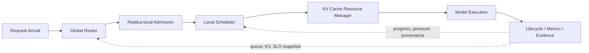

# 大模型推理服务调度与 KV Cache 资源管理

**LLM Serving Scheduling & KV Cache Resource Management**

这是一个基于 [Nano-vLLM](https://github.com/GeeeekExplorer/nano-vllm) 扩展的 LLM Serving Systems Research / Engineering 项目。项目研究请求到达后，如何在有限 KV Cache 下完成 Global Routing、Admission Control、Prefill/Decode Scheduling、Preemption/Recompute 控制与可审计性能评估。

本仓库是最终系统的 clean snapshot。完整研发历史、失败实验与 invalid artifacts 保存在 legacy repository；本仓库只保留最终代码、必要 benchmark、合法 evidence、关键测试和复现资料。两者关系见 [Provenance](docs/PROVENANCE.md)。

## 1. 问题背景

LLM Serving 的瓶颈不仅是计算吞吐。每个活跃请求都持续占用 KV Cache；Prefill 一次需要处理多 token，Decode 每步只推进少量 token，两种 phase 会竞争计算与 KV allocation。Prefix reuse 又使“完整请求大小”不等于“当前增量 KV 需求”。

在高压下，简单策略会形成反馈环：

```text
KV full
→ Waiting Prefill 申请失败
→ resident Decode 被 preempt
→ request 回到 WAITING
→ 历史上下文重新 Prefill
→ Recompute 与 Scheduler work amplification
```

单 Replica 内控制住该反馈环后，多个独立 Replica 仍可能因 Round Robin 忽略 queue/KV state 而产生 skew。此时 raw throughput 可以保持不变，但更多请求错过 TTFT/ITL SLO，导致 SLO Goodput 下降。因此本项目同时研究资源效率、tail latency、负载均衡和实验正确性。

详细问题定义见 [PROBLEM_DEFINITION](docs/PROBLEM_DEFINITION.md)。

## 2. 系统架构



每个 Replica 独立拥有 Scheduler、BlockManager、KV/Prefix Cache 与 ModelRunner。Global Router 只读取 snapshot 并选择 Replica，不直接管理多个 Replica 的物理 KV；目标 Replica 仍需独立执行 Admission。各层的输入、状态所有权和不变量见 [ARCHITECTURE](ARCHITECTURE.md) 与 [SYSTEM_DESIGN](docs/SYSTEM_DESIGN.md)。

## 3. 核心设计

1. **KV / Prefix-aware Admission**：区分 full footprint、active shared blocks 与 inactive cached blocks，以 `full_required - active_shared` 建模 incremental KV reservation；结合 terminal release 形成 request-level resource contract。
2. **Recompute-aware Scheduling**：按 resident KV、releasable blocks、remaining decode tokens 与 estimated recompute cost 统一两条 preemption path 的 victim selection，切断反复抢占与恢复 Prefill 的放大环。
3. **SLO-aware Bounded Drain**：以 episode budget、waiting-age bound、progress gap 与 SLO watch 限制无界 Decode drain，在资源释放和 token fairness 之间建立可验证边界。
4. **Unified Mixed Token Budget**：在同一 Scheduler step 内分配 `max_num_batched_tokens`，支持 Decode accounting、partial Prefill 与 incremental KV allocation；执行端仍按 phase 拆分 sub-batch，**不是 fused mixed Attention**。
5. **Multi-Replica Resource-aware Routing**：Router 使用 capacity feasibility、free/used KV、queue、running、oldest waiting age 与 deterministic tie-break 选择 Replica；各 Replica 的 KV/Prefix Cache 不共享。
6. **Auditable Benchmark / Runtime Provenance**：冻结 trace/config/seed，进行 matched multi-seed comparison；从 raw events 重算结果，并验证 PID、physical GPU UUID、model residency、CUDA execution/overlap、terminal reconciliation 和 final KV state。

## 4. 核心正式结果

下表引用 [FINAL_RESULTS](docs/FINAL_RESULTS.md) 中的合法 evidence。所有 Multi-GPU 指标均来自 corrected post-GPU-binding-fix artifacts。

| 问题 | Baseline → Candidate | 冻结条件 | 结果 | Evidence |
|---|---|---|---|---|
| Prefix-aware Admission | `kv_aware_fifo` → `prefix_aware_fifo` | 90% reuse、8 KV blocks、3 seeds | SLO Goodput `0.1333 → 0.2444 rps`（`+83.3%`）；mean reject `6.00 → 2.67`（`-55.6%`） | [Stage 11](experiments/results/final/admission/stage11/stage11_formal_r1_aggregate_r2.json) |
| Bounded Drain tail control | unbounded `recompute_aware` → bounded | 9 matched capacity × seed pairs | ITL P99 `48283.42 → 9318.95 ms`（`-80.70%`），9/9 改善 | [Stage 16](experiments/results/final/scheduler/stage16/stage16_diagnostic_r2.aggregate.json) |
| Bounded Drain resource control | `pressure_aware_decode` → bounded | 同一 9 matched pairs | Actual Recompute `-75.63%`；Preemption `-54.37%`，均 9/9 改善 | [Stage 16 analysis](experiments/results/final/scheduler/stage16/analysis/analysis.json) |
| Resource-aware Routing | Round Robin → Resource-aware | 4.8 req/s、3 seeds | TTFT P99 `-35.90%`；ITL P99 `-59.41%`；Goodput `+56.94%`；throughput 不变 | [corrected Stage 18](experiments/results/final/multi_replica/stage18/evidence_review.json) |
| Resource-aware Routing | Round Robin → Resource-aware | 6.0 req/s、3 seeds | TTFT P99 `-61.77%`；ITL P99 `-39.26%`；Goodput `+148.15%`；throughput 不变 | [corrected Stage 18](experiments/results/final/multi_replica/stage18/evidence_review.json) |

Stage 18 corrected formal matrix 为 12 cells / 6 matched pairs，review `PASS`。它证明的是 saturation 区间的 tail latency、queue/KV balance 与 SLO serving efficiency 改善，**不是 raw throughput 提升**。

## 5. 性能边界

- **Saturation-dependent**：P0-1 的 queue/latency knee 为 `3.6 req/s`。低负载下两种 Router 没有稳定优劣；接近 saturation 后 Resource-aware 才明显缓解 queue skew 和 SLO collapse。
- **Workload-dependent**：Prefix-heavy 收益最大；Prefill-heavy 有轻微 ITL trade-off；Decode-heavy 的 ITL/Goodput 退化；Balanced 的 TTFT、ITL、Goodput 均退化，是明确 no-benefit boundary。
- **Prefix locality 与 load balance 冲突**：Prefix-heavy 的 corrected 收益主要来自 balance，candidate 并未增加 matched prefix blocks。
- **P/D 不是天然优化**：1P1D、KV remapping 和 pinned-host staging 已完成，但 corrected diagnostic 中 Prefill queue + KV transfer overhead 超过 isolation benefit，故停止扩展 formal matrix。

机制分析见 [PERFORMANCE_ANALYSIS](docs/PERFORMANCE_ANALYSIS.md)。


## 6. 项目结构

```text
nanovllm/                         最终 Nano-vLLM runtime 与 serving 扩展
experiments/benchmark/            Open-loop、lifecycle 与 evidence primitives
experiments/configs/              精选 smoke / frozen formal configs
experiments/data/                 对应 traces
experiments/results/final/        唯一迁移的合法 final evidence
reproduction/                     环境快照与单 Engine smoke
tests/                            核心策略、系统不变量与 evidence pipeline tests
docs/                             问题、设计、演进、结果、分析与 provenance
scripts/                          repository/evidence validation utilities
```

## 7. 快速开始

要求 Python `3.10–3.12`、兼容的 PyTorch/CUDA、Triton、FlashAttention 与本地模型权重。模型不进入 Git。

```bash
python -m pip install --no-build-isolation -e ".[test]"
python reproduction/run_smoke.py \
  --config reproduction/configs/smoke_eager.json \
  --model-path /absolute/path/to/Qwen3-0.6B
```

仅运行 CPU / non-GPU contract tests：

```bash
python -m pytest -q \
  tests/test_scheduler_baseline.py \
  tests/test_prefix_aware_admission.py \
  tests/test_bounded_recompute_scheduler.py \
  tests/test_multi_replica_router.py
```

完整复现、formal replay 和 GPU provenance gate 见 [REPRODUCIBILITY](docs/REPRODUCIBILITY.md)。请始终把本地输出写入 `experiments/results/local/`，不要覆盖 `experiments/results/final/`。

## 8. 文档导航

- [项目总览](docs/PROJECT_OVERVIEW.md)
- [问题定义](docs/PROBLEM_DEFINITION.md)
- [系统设计](docs/SYSTEM_DESIGN.md)
- [技术演进](docs/PROJECT_EVOLUTION.md)
- [最终结果](docs/FINAL_RESULTS.md)
- [性能分析](docs/PERFORMANCE_ANALYSIS.md)
- [工程实践](docs/ENGINEERING_PRACTICES.md)
- [复现指南](docs/REPRODUCIBILITY.md)
- [仓库与 evidence provenance](docs/PROVENANCE.md)
- [已知边界](docs/KNOWN_LIMITATIONS.md)
- [技术专题](docs/TECHNICAL_NOTES/README.md)

## 9. 项目边界

- FlashAttention、Paged KV Cache、Prefix Cache、CUDA Graph、Triton kernel 等来自 Nano-vLLM upstream；归属说明见 [NOTICE](NOTICE.md)。
