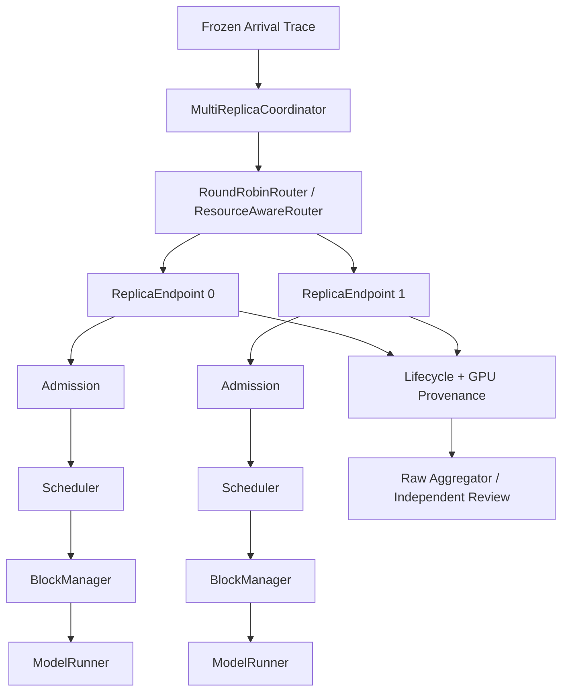
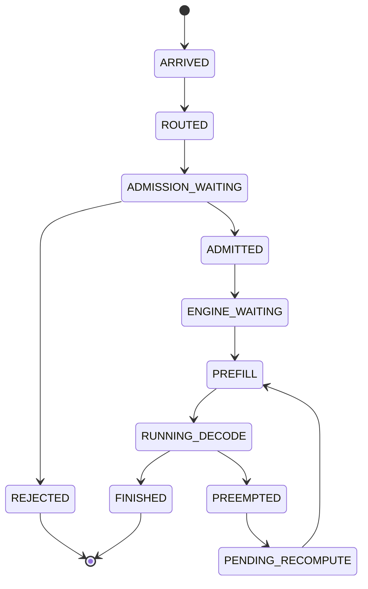

# 系统设计

## 1. Component Graph



## 2. 分层职责与数据契约

| 层 | 输入 | 拥有的状态 | 决策 | 输出/下一层 |
|---|---|---|---|---|
| Arrival | frozen trace、wall clock | arrival cursor | 何时注入 request | Routed request |
| Router | request、Replica snapshots | round-robin cursor / deterministic tie-break | 选择目标 Replica | target + reason |
| Admission | request footprint、prefix preview、queue/SLO estimate | reservation、admit/reject lifecycle | 接纳、等待或拒绝 | Engine waiting request |
| Scheduler | waiting/running、KV pressure、progress/SLO state | policy state、drain episode、preemption counters | 本 step 推进谁和多少 token | scheduled metadata |
| KV Manager | sequence tokens、allocation request | physical blocks、ref count、hash cache | allocate/append/free/prefix match | block table / preview |
| Model Execution | phase metadata、block table | model buffers、CUDA execution state | 执行 Prefill 或 Decode | logits/token/timing |
| Evidence | raw lifecycle、step、GPU events | immutable artifacts | reaggregate、reconcile、review | valid/invalid decision |

## 3. Request Lifecycle

`experiments.benchmark.lifecycle.RequestRecord` 记录 arrival、admit/reject、first token、per-token timestamp 与 terminal state。Scheduler 内部的 `SequenceStatus` 则表达 WAITING、RUNNING 和 FINISHED。两套状态有关联但不等价：Admission rejection 不应伪装成 Scheduler preemption，benchmark terminal 也不能只从 output length 推断。



## 4. KV Cache 状态与 Reservation

`BlockManager` 是 local physical KV 的唯一写入者。`preview_prefix_cache()` 是无副作用读接口，返回 matched、active shared 与 incremental reservation 信息。Admission 和 Router 可读取 preview，但不能提前 allocate physical blocks。

Request-level reservation 的不变量是：

```text
reserved_incremental_blocks
= admitted request incremental demand
- terminal request reservation release
```

Physical allocation 的不变量是 block ref count 与 free/used/total 守恒。Formal cell 结束时，同时检查未终结 request、未释放 reservation 和 non-zero final KV。

## 5. Admission Control

- `kv_aware_fifo` 使用 full footprint 做保守 reservation；
- `prefix_aware_fifo` 使用 active shared prefix 扣减后的 incremental demand；
- `slack_aware_prefix_fifo` 再加入 queue waiting、service ETA、TTFT/ITL deadline 与 slack，对不可行 head 做 early rejection。

Admission 输出的是“进入目标 Replica 的资格”，不是 token schedule。它不修改 `Scheduler.running`，也不替 Router 做跨 Replica 选择。

## 6. Scheduler Policies

`Config.scheduler_policy` 暴露的 final runtime policy 包括 `prefill_first`、`decode_first_budgeted`、`pressure_aware_decode`、`chunked_prefill_budgeted`、`recompute_aware`、`recompute_aware_bounded`、`mixed_token_budget` 与 `mixed_slo_budget`。

### Recompute-aware Victim Selection

`ResidentSequenceCost` 记录 resident KV、releasable blocks、remaining decode、estimated steps to release 与 estimated recompute tokens。`select_recompute_victim()` 同时服务 Waiting allocation failure 和 Decode expansion failure，避免两条 preemption path 使用不同语义。

### Bounded Drain

`recompute_aware_bounded` 保留 victim cost model，同时增加：

- drain episode token/step budget；
- waiting-age bound；
- episode entry TTFT/ITL watch；
- bounded Prefill progress window；
- exit reason 与 progress-gap observability。

这些 guard 限制无界 drain，但不保证 TTFT 相对所有 baseline 都改善。

### Mixed Token Budget

`max_num_batched_tokens` 是 step-level global budget。Scheduler 先计算 Decode token accounting，再分配 Prefill budget，支持 partial Prefill 与 `incremental_kv_allocation`，输出 `MixedScheduleBatch` 和 per-request `ScheduledSequence`。

`LLMEngine` / `ModelRunner` 按 phase 形成 eager sub-batch，并恢复 request/sampling 顺序。因此实现边界是 **unified scheduling + phase-aware execution**，不是 fused mixed Attention。

## 7. Multi-Replica Global Routing

`ReplicaStateSnapshot` 包含 total/free/used KV、waiting、running、oldest waiting age，以及可选 matched/active prefix blocks。`ResourceAwareRouter`：

1. 排除 capacity infeasible Replica；
2. 比较 queue/KV resource pressure；
3. 使用 deterministic tie-break；
4. 返回 target 和 decision reason。

每个 `ProcessReplicaEndpoint` 在独立 worker process 中持有 local engine。Coordinator 只能通过 endpoint RPC 获取 snapshot、提交 request 和收集 event。

## 8. Model Execution

Nano-vLLM upstream 的 `ModelRunner` 负责模型加载、Attention、KV write、sampling 和 CUDA execution。本项目扩展 mixed metadata、step timing 与 P/D materialization/install 接口，但没有改写 FlashAttention 或 Triton kernel。

## 9. P/D Data Flow

`PrefillTransferMetadata` 描述 logical sequence 和 source materialization。`pack_materialized_kv()` 将 source KV 与 metadata 打包，经 pinned host buffer 传输；destination 先分配 physical blocks，再由 `install_materialized_kv()` 写入并重建 logical mapping，`restore_decode_sequence()` 恢复 sequence/RNG state。

该实现验证了功能链和资源释放，但当前不是 direct GPU P2P，也没有正性能收益。

## 10. Evidence Data Flow

```text
config + trace + code fingerprint
→ raw request / step / admission / GPU events
→ terminal + KV reconciliation
→ matched-pair aggregation
→ independent raw-artifact review
→ FINAL_RESULTS
```

聚合器不能只读取已有 summary；它必须从 raw events 重算 primary metrics，并验证 trace/config/code/model/runtime fingerprint。Multi-GPU 额外验证 physical UUID 与 CUDA overlap。任何缺失、截断、分母不一致或 topology violation 都 fail closed。

## 11. Failure Modes

| Failure mode | 机制 | 控制/证据 |
|---|---|---|
| Prefill/preempt/recompute loop | KV full 时反复释放和恢复 | Actual Recompute + unified victim selection |
| Unbounded drain starvation | 少量 resident Decode 长时间独占 progress | episode budget + waiting/SLO guards |
| Prefix over-reservation | shared prefix 被重复计入 full footprint | active/inactive cache semantics |
| Replica skew | Round Robin 忽略 work/KV/queue | Resource-aware snapshot routing |
| Fake Multi-GPU | logical index 不等于 physical identity | Torch/NVML UUID + residency + CUDA overlap |
| P/D overhead inversion | isolation benefit 小于 queue + transfer | queue/transfer breakdown + stop condition |

## 12. 设计边界

- Replica KV 不共享，Router 不实现 distributed KV manager。
- Prefix-aware Router score 在源码中存在，但 final corrected benefit 主要来自 load balance。
- Mixed scheduling 不改变 Attention kernel 执行模型。
- P/D 使用 pinned-host staging。
- 所有性能结论仅适用于对应冻结环境和 workload。
